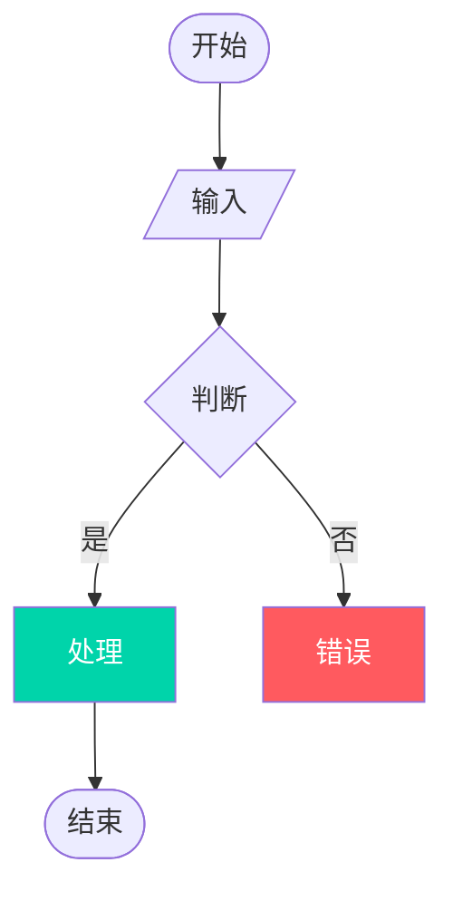
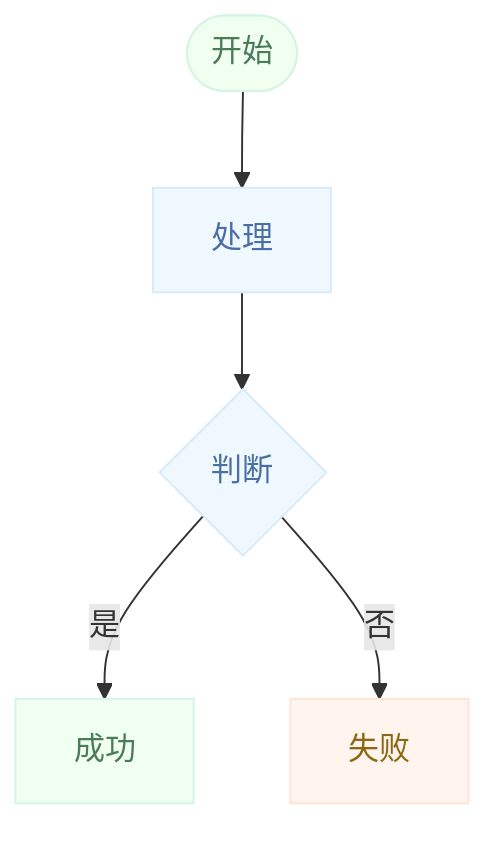
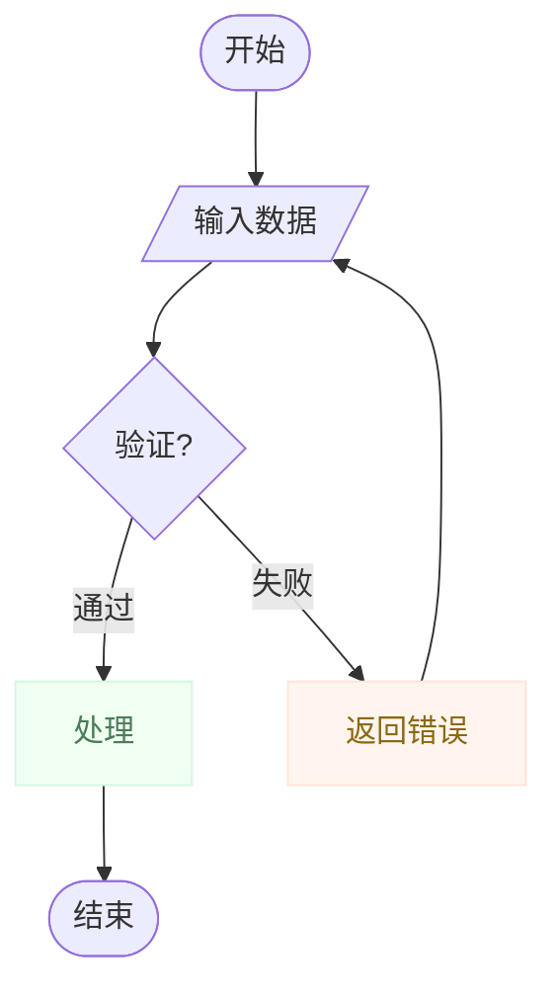
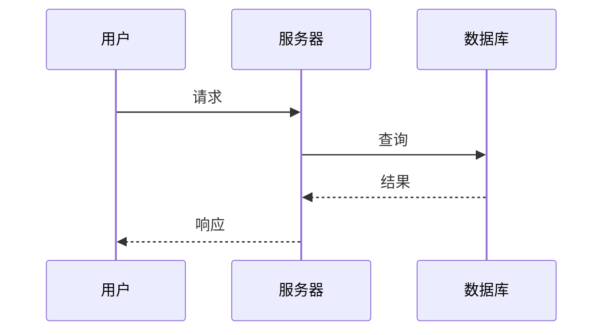
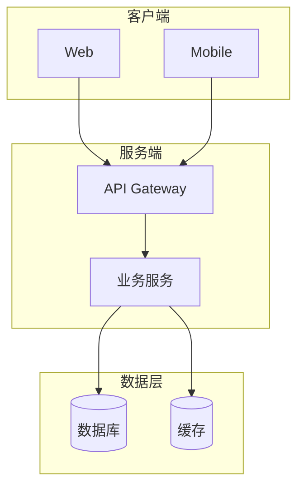

## 核心原则

**稳定 → 准确 → 美观 → 合理**

1. **稳定**: 语法正确，渲染无误
2. **准确**: 信息完整，逻辑清晰
3. **美观**: 主题统一，配色优雅
4. **合理**: 结构恰当，易于理解

---

## 工作流程（必须遵循）

```
需求分析 → 结构设计 → 布局思考 → 主题选择 → 代码生成 → 验证修复 → 布局评估 → 输出
    ↑                    ↑                                       |
    └────────────────────┴─────────── 循环直到评估通过 ←───────────┘
```

### Phase 1: 需求分析

| 要素 | 问题 |
|------|------|
| 图表类型 | flowchart / sequence / class / state / gantt / pie ? |
| 目的 | 这个图表要讲什么故事？ |
| 受众 | 给谁看？技术人员 / 产品 / 管理层？ |
| 复杂度 | 节点数 ≤15？ |

### Phase 2: 结构设计

**规则：**
- 默认 `TD`（自上而下）
- 宽图用 `LR`（从左到右）
- 相关节点用 `subgraph` 分组
- 最小化交叉线

### Phase 2.5: 布局思考（生成前必做）

在写Mermaid代码前，先用1-2句话回答：
- **节点数量**：≤15？用TD；>15？考虑LR或拆分
- **分组策略**：哪些节点归入subgraph？命名和层级？
- **关键路径**：数据流从哪到哪？避免交叉

思考完成后直接生成代码，不要单独输出思考过程。

### Phase 3: 主题选择

| 场景 | 推荐主题 |
|------|----------|
| 文档/博客 | `macaron-blue` |
| 技术架构 | `tokyo-night` 或 `github-dark` |
| 产品流程 | `macaron-mint` |
| 成功/完成 | `macaron-mint` |
| 警告/错误 | `macaron-peach` |
| 创意/设计 | `macaron-lavender` |
| 通用 | `github-light` |

### Phase 4: 代码生成



### Phase 5: 验证修复（关键）

**必须使用 mcp-mermaid 验证：**

```bash
# 1. 写入临时文件
cat > /tmp/diagram.mmd << 'EOF'
%% theme: macaron-mint
flowchart TD
    A[开始] --> B[结束]
EOF

# 2. 验证
mcp-mermaid validate /tmp/diagram.mmd

# 3. 如果失败，分析错误并修复
# 4. 重复验证直到通过
# 5. 渲染输出
mcp-mermaid render /tmp/diagram.mmd -o output.svg
```

**常见错误及修复：**

| 错误 | 修复 |
|------|------|
| `Parse error on line X` | 检查括号、引号、箭头 |
| `Unclosed statement` | 闭合 `[]`, `(){}` |
| `Invalid style` | 检查 style 语法 |
| `Unknown theme` | 检查主题名称 |
| `Duplicate node ID` | 使用唯一 ID |

### Phase 5.5: 布局评估与优化

验证通过后，用以下清单自检，发现问题则返回Phase 2.5重新生成：

| 评估维度 | 检查项 | 优化策略 |
|----------|--------|----------|
| **节点密度** | 单层节点 ≤5？ | 超过则拆分subgraph或改LR |
| **连线交叉** | 相邻层连线是否交叉？ | 调整节点顺序或改TD/LR |
| **分组合理性** | subgraph边界清晰？ | 按职责/层级重新分组 |
| **流向一致性** | 数据流方向是否统一？ | 统一用TD或LR，避免混用 |
| **留白充足** | 节点间有呼吸空间？ | 简化节点文字或增加间距 |

**优化循环**：最多3轮，超过则输出当前最优版本。

### Phase 6: 输出

```markdown
# [图表标题]

```mermaid
%% theme: [theme]
flowchart TD
    [节点和连线]
    
    %% 仅强调特殊状态
    style Success fill:#00D4AA,color:#fff
    style Error fill:#FF5A5F,color:#fff
```

**验证状态**: ✅ 语法正确 / ✅ 渲染成功
```

---

## 主题系统

### 两色基础（来自 beautiful-mermaid）

每个图表只需 2 个颜色：
- **bg**: 背景色
- **fg**: 前景色/文字色

其他颜色自动派生：

| 元素 | 派生方式 |
|------|----------|
| 文字 | fg 100% |
| 次要文字 | fg 60% |
| 边标签 | fg 40% |
| 连接线 | fg 50% |
| 节点填充 | fg 3% 混入 bg |
| 节点边框 | fg 20% 混入 bg |

### 内置主题

#### 浅色主题

| 主题 | 背景 | 强调色 | 适用场景 |
|------|------|--------|----------|
| `github-light` | #ffffff | #0969da | 专业文档 |
| `catppuccin-latte` | #eff1f5 | #8839ef | 柔和现代 |
| `nord-light` | #eceff4 | #5e81ac | 冷静专业 |

#### 深色主题

| 主题 | 背景 | 强调色 | 适用场景 |
|------|------|--------|----------|
| `tokyo-night` | #1a1b26 | #7aa2f7 | 现代活力 |
| `github-dark` | #0d1117 | #4493f8 | 开发者友好 |
| `dracula` | #282828 | #bd93f9 | 大胆彩色 |
| `one-dark` | #282c34 | #c678dd | 经典平衡 |

---

## 马卡龙配色系统

### 核心原则

**Border 和 Background 同色系，明度差异 ≤5%**

这样边缘柔和，视觉统一。

### 色彩定义

| 色系 | Background | Border | Text | 用途 |
|------|------------|--------|------|------|
| Pink 粉 | #FFF0F5 | #FFD6E7 | #8B4557 | 成功/正向 |
| Blue 蓝 | #F0F8FF | #D6EAF8 | #4A6FA5 | 信息/中性 |
| Mint 薄荷 | #F0FFF0 | #D5F5E3 | #4A7C59 | 成功/完成 |
| Lavender 薰衣草 | #F8F0FF | #E8D5F5 | #6B4C7D | 特殊/创意 |
| Peach 桃 | #FFF5EE | #FFE4D6 | #8B6914 | 警告/注意 |
| Lemon 柠檬 | #FFFFF0 | #FFF9D6 | #8B8B00 | 警告/高亮 |

### HSL 规则

```
Background: H + S(15-25%) + L(96-98%)
Border:     H + S(15-25%) + L(91-93%)
Text:       H + S(30-40%) + L(30-40%)
```

**关键：S 保持一致，L 差异 ≤5%**

### 使用示例



---

## 样式规则

### 何时添加样式

**不要**为以下元素添加样式：
- 普通节点
- 普通连线
- 标准判断

**仅**为以下状态添加样式：
- ✅ **成功** 状态
- ❌ **错误** 状态
- ⚠️ **警告** 状态
- 🔑 **关键** 路径

### 样式语法

```mermaid
%% 正确
style NodeID fill:#颜色,color:#文字颜色

%% 连线样式
linkStyle 0 stroke:#颜色,stroke-width:2px
```

---

## 图表模板

### 流程图模板



### 时序图模板



### 架构图模板



---

## 质量检查清单

- [ ] **语法**: Mermaid 语法正确
- [ ] **主题**: 已声明主题
- [ ] **完整性**: 所有路径都有终点
- [ ] **可读性**: 节点数 ≤15
- [ ] **样式**: 仅特殊状态有样式
- [ ] **验证**: 通过 mcp-mermaid 验证

---

## 故障排除

| 问题 | 原因 | 解决方案 |
|------|------|----------|
| 主题不生效 | 主题名拼写错误 | 检查 `%% theme: name` |
| 颜色不对 | 主题不存在 | 用 `mcp-mermaid themes` 查看可用主题 |
| 布局混乱 | 节点过多 | 切换 TD/LR，减少节点 |
| 文字重叠 | 节点太密 | 增加间距，简化内容 |
| 边缘太锐 | border/bg 不同色系 | 使用马卡龙配色，明度差 ≤5% |
| 语法错误 | 括号未闭合 | 用 `mcp-mermaid validate` 检查 |

---

## 参考资源

- [beautiful-mermaid](https://github.com/lukilabs/beautiful-mermaid) - 主题系统参考
- [mcp-mermaid](https://github.com/hustcc/mcp-mermaid) - 验证工具
- [Mermaid 官方文档](https://mermaid.js.org/) - 语法参考
- [Happy Hues](https://www.happyhues.co/) - 配色灵感
