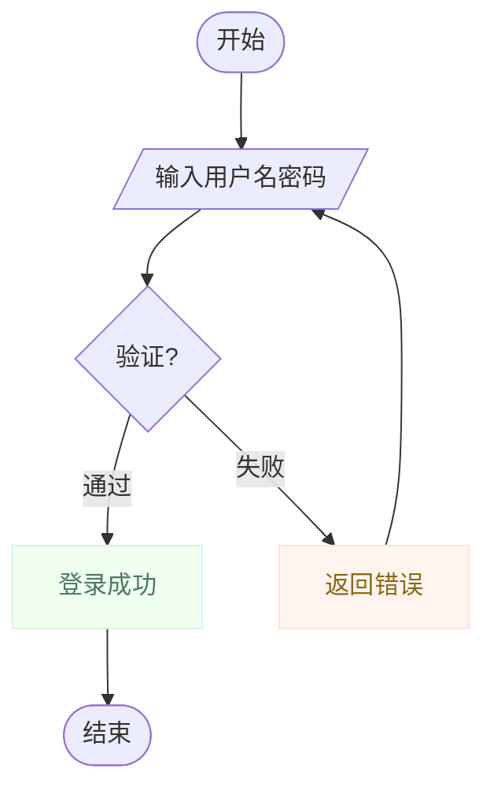

# Example: User Login Flow

## Request

```
创建一个用户登录流程图
```

## Generated Diagram


```mermaid
%% theme: github-light
flowchart TD
    A([开始]) --> B[/输入用户名密码/]
    B --> C{验证?}
    C -->|通过| D[登录成功]
    C -->|失败| E[返回错误]
    D --> F([结束])
    E --> B
    
    style D fill:#F0FFF0,stroke:#D5F5E3,color:#4A7C59
    style E fill:#FFF5EE,stroke:#FFE4D6,color:#8B6914
```

## Notes

- Theme: github-light (documentation style)
- Layout: TD (top-down)
- Nodes: 6 (≤15 threshold)
